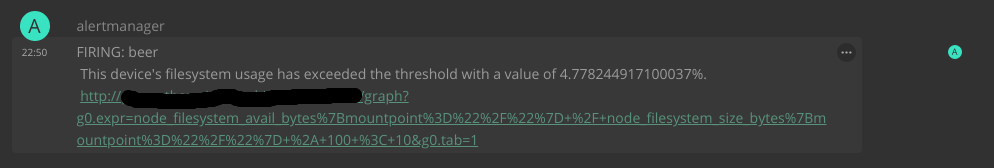

 [](https://cloud.docker.com/u/jaywink/repository/docker/jaywink/matrix-alertmanager) [](https://matrix.to/#/#matrix-alertmanager:feneas.org)

[](https://git.feneas.org/jaywink/matrix-alertmanager/issues)

# Matrix-Alertmanager



A bot to receive Prometheus Alertmanager webhook events and forward them to chosen rooms.

Main features:

* Uses pre-created Matrix user to send alerts using token auth
* Configurable room per alert receiver
* Automatic joining of configured public rooms on start up
* Secret key authentication with Alertmanager

## How to use

### Configuration

Whether running manually or via the Docker image, the configuration is set via environment variables. When running manually, copy `.env.default` into `.env`, set the values and they will be loaded automatically. When using the Docker image, set the environment variables when running the container.

### Docker

The [Docker image](https://cloud.docker.com/repository/docker/jaywink/matrix-alertmanager) `jaywink/matrix-alertmanager:latest` is the easiest way to get the service running. Ensure you set the required environment variables listed in `.env.default` in this repository.

### Alertmanager

You will need to configure a webhook receiver in Alertmanager. It should looks something like this:

```yaml
receivers:
- name: 'myreceiver'
  webhook_configs:
  - url: 'https://my-matrix-alertmanager.tld/alerts?secret=veryverysecretkeyhere'
```

The secret key obviously should match the one in the alertmanager configuration.

### Prometheus rules

Add some styling to your prometheus rules

```yaml
rules:
- alert: High Memory Usage of Container
  annotations:
    description: Container named <strong>{{\$labels.container_name}}</strong> in <strong>{{\$labels.pod_name}}</strong> in <strong>{{\$labels.namespace}}</strong> is using more than 75% of Memory Limit
  expr: |
    ((( sum(container_memory_usage_bytes{image!=\"\",container_name!=\"POD\", namespace!=\"kube-system\"}) by (namespace,container_name,pod_name, instance)  / sum(container_spec_memory_limit_bytes{image!=\"\",container_name!=\"POD\",namespace!=\"kube-system\"}) by (namespace,container_name,pod_name, instance) ) * 100 ) < +Inf ) > 75
  for: 5m
  labels:
    team: dev
```

NOTE! Currently the bot cannot talk HTTPS, so you need to have a reverse proxy in place to terminate SSL, or use unsecure unencrypted connections.

## TODO

* HTTPS support without reverse proxy
* Better test coverage
* Nicer formatting of messages
* Registering an account instead of having to use an existing account
* Joining rooms that are configured automatically

## Tech

Node 10, Express, Matrix JS SDK

## Author

Jason Robinson / https://jasonrobinson.me / @jaywink:feneas.org

## License

MIT
